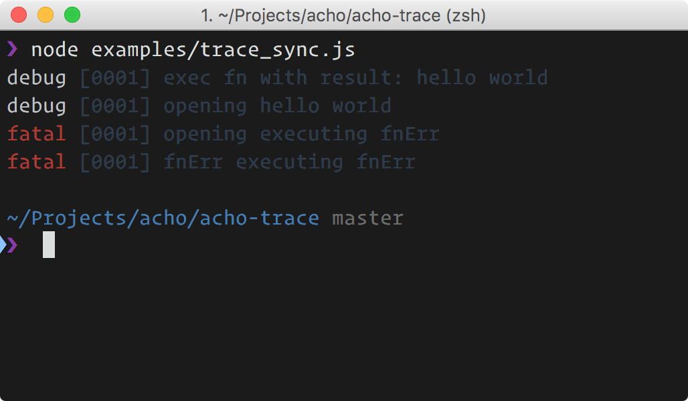

# acho-trace

<p align="center">
  <br>
  
  <br>
</p>


[](https://travis-ci.org/achohq/acho-trace)
[](https://david-dm.org/achohq/acho-trace)
[](https://david-dm.org/achohq/acho-trace#info=devDependencies)
[](https://www.npmjs.org/package/acho-trace)
[](https://paypal.me/achohq)

> It Envolves async/sync methods for automatically logs traces. Inspired in [Apex log](https://medium.com/@tjholowaychuk/apex-log-e8d9627f4a9a#.bcewdjlmr).

## Install

```bash
$ npm install acho-trace --save
```

## Usage

First load the plugin:

```js
const Acho = require('acho')
Acho = require('acho-trace')(Acho)
```
Now when you call `Acho` for create a new instance, the new instance will have `.trace` and `.traceSync` methods for envolve functions and create traces.

For see it in action check examples.

## API

The API provides to endpoints:

- acho#trace
- acho#traceSync

both methods follow the same interface:

```js
'use strict'

var Acho = require('acho')
Acho = require('acho-trace')(Acho)

var acho = Acho()
var fn = createFnAsync()
var wrapFnOne = acho.trace(fn, {

  /*
    OPTIONAL. [default=false]
    It expresses if you are wrapping a sync function.
    Also you can use `acho#traceSync` endpoint.
  */
  sync: false,

  /*
    OPTIONAL. [default='debug']
    output level under non-error result.
  */
  level: 'debug',

  /*
    OPTIONAL. [default='error']
    output level under error result.
  */
  levelErr: 'error',

  /*
    OPTIONAL. [default='']
    context associated with the message.
  */
  context: '',

  /*
    OPTIONAL.
    Custom print function to create print
    messages under non-error.

    By default it prints the arguments
    passed in the original function.
  */
  trace: function (obj) {
    return ['executed fn with params: %j', obj]
  },

  /*
    OPTIONAL.
    Custom print function to create print
    messages under error.

    By default it prints the arguments
    passed in the original function.
  */
  traceErr: function (err) {
    return ['something bad happens: %s', err.message]
  }
})
```

## License

MIT © [Kiko Beats](http://www.kikobeats.com)
